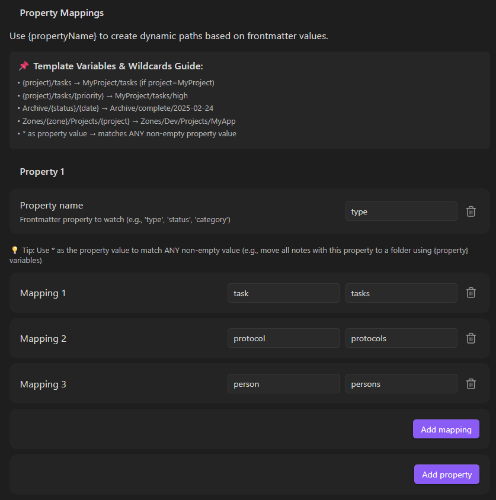

# PropMove

PropMove is a tiny Obsidian plugin that automatically moves notes based on frontmatter property values. It listens for note creation and frontmatter updates (including templates) and moves matching notes into configured folders.

## Features

- Move notes on create and metadata changes.
- Multiple properties, each with value-to-folder mappings.
- Automatically append unique suffix if filename exists (configurable, ON by default).
- Creates missing target folders automatically.
- Avoids move loops and conflicts.

## Installation (manual)

1. Copy this folder to `.obsidian/plugins/propmove` in your vault.
2. In Obsidian, enable the plugin under Community Plugins.

## Configuration

Open PropMove settings and add one or more properties with mappings.

Example:

Property: `type`

- `task` -> `Tasks`
- `protocol` -> `Protocols`
- `daily` -> `Daily`

Property: `status`

- `draft` -> `Inbox/Drafts`
- `final` -> `Archive`

## Notes

- By default, if a target note already exists, PropMove automatically appends a numeric suffix (e.g., "note 1.md", "note 2.md") to avoid conflicts. This can be disabled in settings.
- The first matching property mapping wins.
- The plugin recursively finds unique filenames until the move succeeds.

## Development

This is a plain Obsidian plugin folder with `manifest.json` and `main.js`.

## License

MIT
