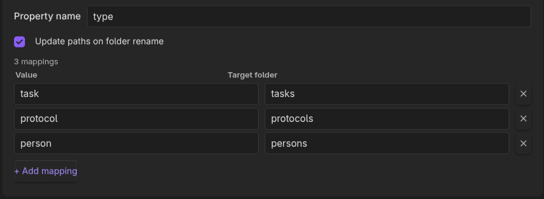
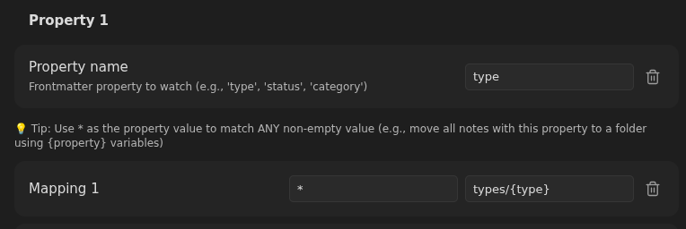

# PropMove

Automatically move notes based on frontmatter properties. **It just works.**

> 💡 **Built with AI** — This plugin is developed and maintained via AI agents.
> I use AI as my primary tool for implementation, issue handling, and maintenance.
> You are free to choose whether to use this plugin based on that.

<a href="https://www.buymeacoffee.com/yffbptmtaa" target="_blank"></a>

## Flexible mapping based on property values

Simple. Manually map specific values:



Variable. Use wildcards to let the extension create folders based on whatever value your property has: 



## Features

- **Auto-move on create/update:** Watches frontmatter changes and moves notes automatically
- **Multiple property mappings:** Define value-to-folder rules per property
- **Smart conflict handling:** Appends unique suffixes (note 1.md, note 2.md) when targets exist
- **Ignore folders:** Protect template folders by excluding them from processing
- **Auto folder creation:** Creates missing target directories automatically
- **Wiki-link stripping:** `[[Project]]` in property values resolves to clean folder names (`Project`)

## Installation

```bash
cd /path/to/your/vault/.obsidian/plugins/
git clone https://github.com/SHU-red/propmove.git
```
Enable in Obsidian Settings → Community plugins

## Configuration

### Property Mappings
Set up properties with value-to-folder rules:

```
Property: type
  • task → Tasks
  • protocol → Protocols
  • daily → Daily

Property: status
  • draft → Inbox/Drafts
  • final → Archive
```

### Ignore Folders
Prevent files in specific folders from being moved (useful for templates):

```
Ignore Folders:
  • templates
  • _archive
  • drafts/work-in-progress
```

## How It Works

1. When a note is created or frontmatter changes, PropMove checks its properties
2. If the note is in an ignored folder, it's skipped
3. First matching property mapping determines the target folder
4. If target file exists, a numeric suffix is appended (configurable)
5. Note is moved to destination; folders created if needed

## Settings

| Setting | Default | Description |
|---------|---------|-------------|
| Auto-append suffix | ON | Append numbers to avoid conflicts |
| Ignore Folders | — | Folders to exclude from processing |
| Properties | — | Property name + value→folder mappings |

## License

MIT
