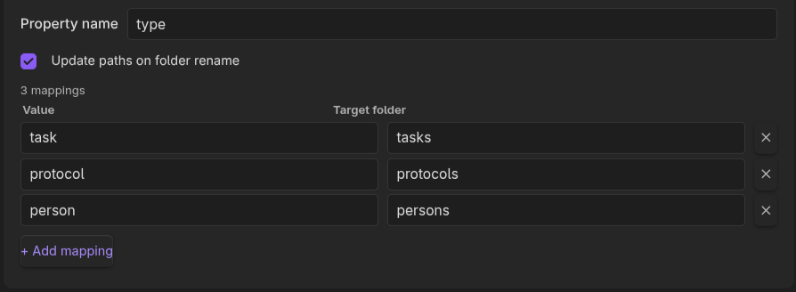
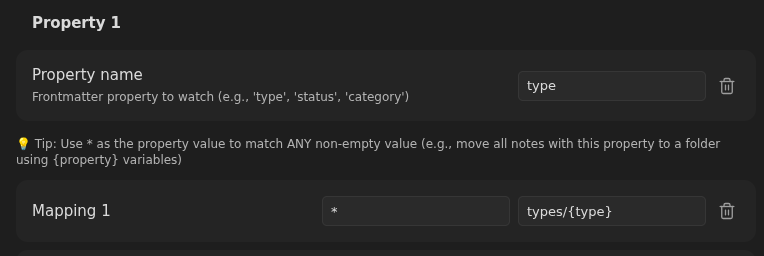

# PropMove

Automatically move notes based on frontmatter properties. **It just works.**

<strong>☕ Buy Me A Coffee</strong>

These are small tools, built with AI — on purpose. There isn't enough time to learn every language and dive into every rabbit hole, so AI lets me solve real problems from my daily life and homelab — and that matters more to me than clever code.

The AI writes most of the code; the idea, the tinkering, testing, publishing and maintenance are mine.

Issues answered, features shipped, a few stars and downloads — does that sound like AI slop? Take a look and make your own opinion.

If this project helps you, <a href="https://www.buymeacoffee.com/yffbptmtaa">buy me a coffee</a> ☕

## Features

- **Auto-move on create/update** — watches frontmatter changes and moves notes automatically
- **Multiple property mappings** — define value-to-folder rules per property
- **Smart conflict handling** — appends unique suffixes when targets exist
- **Ignore folders** — exclude template folders from processing
- **Auto folder creation** — creates missing target directories
- **Wiki-link stripping** — `[[Project]]` resolves to clean folder name
- **Autocomplete** — property names and folder paths suggest from your vault
- **Auto-update paths** — mapping folders follow vault renames automatically
- **Match operators** — equals, contains, is-empty, is-not-empty per mapping

## Screenshots

Simple. Manually map specific values:

Variable. Use wildcards to create dynamic paths:

## How It Works

1. Note created or frontmatter changes
2. If in ignored folder → skipped
3. First matching property mapping determines target folder
4. If target exists → numeric suffix appended (configurable)
5. Note moved to destination, folders created if needed

## License

MIT
